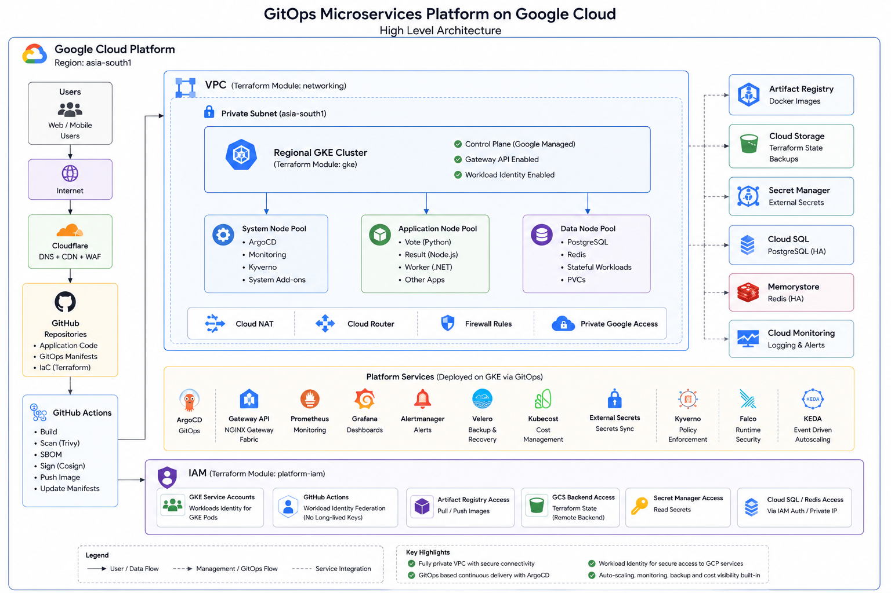
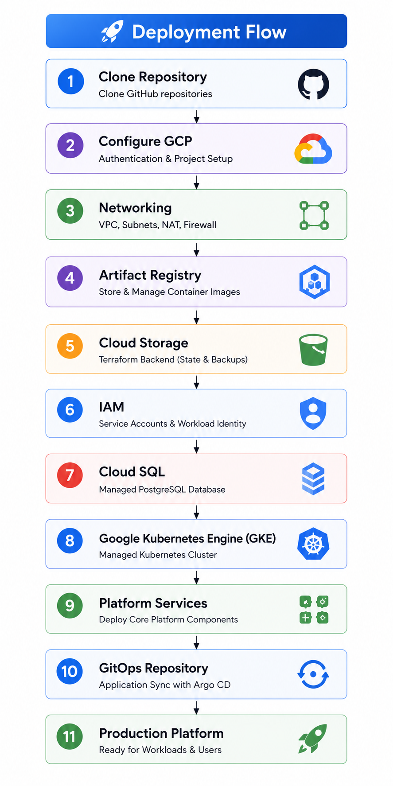

# Platform infrastrucuture

---

## Overview

The Platform Infrastructure repository provisions and manages the foundational cloud infrastructure for a production-oriented Kubernetes platform on `Google Cloud Platform (GCP)`. Infrastructure is defined entirely as code using Terraform, enabling consistent, repeatable, and auditable deployments across environments.

This repository establishes the core platform services required before platform components and applications can be deployed. It includes `networking, Kubernetes infrastructure, identity and access management, container registry, storage, cloud-sql`, and supporting cloud services that serve as the foundation for `GitOps-based application delivery`.

The infrastructure is implemented using reusable Terraform modules following `Infrastructure as Code (IaC)` best practices, with an emphasis on modularity, security, scalability, and maintainability.

---
## Objectives

The primary objectives of this repository are to:

- Provision cloud infrastructure using reusable Terraform modules
- Establish a secure and scalable Kubernetes foundation
- Standardize infrastructure deployment through Infrastructure as Code
- Enable GitOps-based platform and application delivery
- Implement secure identity management using Workload Identity
- Support production-oriented operational practices
- Maintain infrastructure consistency across environments

---

## 📑 Table of Contents
- [🏛 Architecture](#-architecture)
  - [Infrastructure Provisioning Flow](#infrastructure-provisioning-flow)
- [📂 Repository Structure](#-repository-structure)
- [🏗 Infrastructure Components](#-infrastructure-components)
  - [Networking](#networking)
  - [Google Kubernetes Engine](#google-kubernetes-engine)
  - [Platform Workloads](#platform-workloads)
  - [Cloud SQL for PostgreSQL](#cloud-sql-for-postgresql)
  - [Identity and Access Management](#identity-and-access-management)
  - [Workload Identity Federation](#workload-identity-federation)
  - [Artifact Registry](#artifact-registry)
  - [Cloud Storage](#cloud-storage)
  - [Secret Management](#secret-management)
- [🛠 Technology Stack](#technology-stack)
- [📋 Prerequisites](#prerequisites)
  - [Google Cloud Platform](#google-cloud-platform)
  - [Local Tools](#local-tools)
  - [Authentication](#authentication)
  - [Terraform Remote State](#terraform-remote-state)
  - [GitHub](#github)
  - [Required Permissions](#required-permissions)
- [🚀 Getting Started](#getting-started)
  - [Clone the Repository](#1-clone-the-repository)
  - [Authenticate with Google Cloud](#2-authenticate-with-google-cloud)
  - [Deploy Infrastructure Modules](#3-deploy-infrastructure-modules)
  - [Deployment Order](#deployment-order)
  - [Verify the GKE Cluster](#4-verify-the-gke-cluster)
- [🔄 Deployment Workflow](#deployment-workflow)
  - [Workflow Summary](#workflow-summary)
- [🎯 Learning Outcomes](#learning-outcomes)
  - [Infrastructure as Code](#infrastructure-as-code)
  - [Google Cloud Platform](#google-cloud-platform-1)
  - [Identity and Access Management](#identity-and-access-management-1)
  - [Platform Foundation](#platform-foundation)
  - [Architecture & Best Practices](#architecture--best-practices)
- [📚 Module Documentation](#module-documentation)
- [📊 Outputs](#outputs)

---
## Architecture




### Infrastructure Provisioning Flow

1. **`networking`** provisions the networking foundation, including the VPC, private subnet, Cloud Router, Cloud NAT, firewall rules, and Private Google Access.

2. **`gke`** creates the regional Google Kubernetes Engine (GKE) cluster with dedicated node pools, Workload Identity, and Gateway API enabled.

3. **`artifact-registry`** creates the Artifact Registry repositories used to store and distribute container images built by the CI pipeline.

4. **`platform-iam`** provisions service accounts, IAM roles, and Workload Identity Federation required for GKE, Terraform, GitHub Actions, and platform services.

5. **`cloud-storage`** creates the Google Cloud Storage (GCS) bucket used as the Terraform remote state backend.

6. **`cloud-sql`** provisions a managed PostgreSQL instance, including private connectivity, database configuration, users, and automated backups.

7. **`platform-services`** deploys the core Kubernetes platform services required to operate the cluster, including Argo CD, External Secrets, NGINX Gateway Fabric, cert-manager, Kyverno, kube-prometheus-stack, Kubecost, Argo Rollouts, and other shared platform components.

8. After the infrastructure and platform services are deployed, **`Argo CD`** continuously synchronizes application manifests from the GitOps repository, ensuring the cluster remains in the desired state.

---
## Repository Structure

```
platform-infra/
└── terraform/
    ├── environments                      
    |   |
    |   ├── dev    
    |   |    ├── networking/
    |   |    |      ├── .gitignore
    |   │    |      ├── main.tf
    |   |    |      ├── outputs.tf
    |   |    |      ├── provider.tf 
    |   |    |      ├── terraform.tfvars
    |   │    |      └── variables.tf
    |   │    |
    |   |    ├── cloud-sql/
    |   |    |      ├── .gitignore
    |   │    |      ├── main.tf
    |   |    |      ├── outputs.tf
    |   |    |      ├── provider.tf 
    |   |    |      ├── terraform.tfvars
    |   │    |      └── variables.tf
    |   │    |
    |   |    ├── gke/
    |   |    |      ├── .gitignore
    |   │    |      ├── main.tf
    |   |    |      ├── outputs.tf
    |   |    |      ├── provider.tf 
    |   |    |      ├── terraform.tfvars
    |   │    |      └── variables.tf
    |   │    |
    |   |    ├── iam/   
    |   |    |      ├── .gitignore
    |   │    |      ├── main.tf
    |   |    |      ├── outputs.tf
    |   |    |      ├── provider.tf 
    |   │    |      └── variables.tf
    |   │    |
    |   │    ├── platform/
    |   |    |        ├── argo-rollouts/ 
    |   |    |        |         ├── .gitignore
    |   │    |        |         ├── main.tf
    |   |    |        |         ├── outputs.tf
    |   |    |        |         ├── provider.tf
    |   |    |        |         ├── versions.tf 
    |   │    |        |         └── variables.tf
    |   |    |        ├── cert-manager/ 
    |   |    |        |         ├── .gitignore
    |   │    |        |         ├── main.tf
    |   |    |        |         ├── outputs.tf
    |   |    |        |         ├── provider.tf
    |   |    |        |         ├── versions.tf 
    |   │    |        |         └── variables.tf
    |   |    |        ├── argo-rollouts/ 
    |   |    |        |         ├── .gitignore
    |   │    |        |         ├── main.tf
    |   |    |        |         ├── outputs.tf
    |   |    |        |         ├── provider.tf
    |   |    |        |         ├── versions.tf 
    |   │    |        |         └── variables.tf
    |   |    |        ├── external-secrets/ 
    |   |    |        |         ├── .gitignore
    |   │    |        |         ├── main.tf
    |   |    |        |         ├── outputs.tf
    |   |    |        |         ├── provider.tf
    |   |    |        |         ├── versions.tf 
    |   │    |        |         └── variables.tf
    |   |    |        ├── falco/ 
    |   |    |        |         ├── .gitignore
    |   |    |        |         ├── backend.tf
    |   |    |        |         ├── data.tf  
    |   │    |        |         ├── main.tf
    |   |    |        |         ├── outputs.tf
    |   |    |        |         ├── provider.tf
    |   |    |        |         ├── versions.tf 
    |   │    |        |         └── variables.tf
    |   |    |        ├── keda/ 
    |   |    |        |         ├── .gitignore
    |   │    |        |         ├── main.tf
    |   |    |        |         ├── outputs.tf
    |   |    |        |         ├── provider.tf
    |   |    |        |         ├── versions.tf 
    |   │    |        |         └── variables.tf
    |   |    |        ├── kubecost/ 
    |   |    |        |         ├── .gitignore
    |   │    |        |         ├── main.tf
    |   |    |        |         ├── outputs.tf
    |   |    |        |         ├── provider.tf
    |   |    |        |         ├── versions.tf 
    |   │    |        |         └── variables.tf
    |   |    |        ├── kyverno/ 
    |   |    |        |         ├── .gitignore
    |   │    |        |         ├── main.tf
    |   |    |        |         ├── outputs.tf
    |   |    |        |         ├── provider.tf
    |   |    |        |         ├── versions.tf 
    |   │    |        |         └── variables.tf
    |   |    |        ├── monitoring/ 
    |   |    |        |         ├── .gitignore
    |   │    |        |         ├── main.tf
    |   |    |        |         ├── outputs.tf
    |   |    |        |         ├── provider.tf
    |   |    |        |         ├── versions.tf 
    |   │    |        |         └── variables.tf
    |   |    |        ├── nginx-gateway/ 
    |   |    |        |         ├── .gitignore
    |   │    |        |         ├── main.tf
    |   |    |        |         ├── outputs.tf
    |   |    |        |         ├── provider.tf
    |   |    |        |         ├── versions.tf 
    |   │    |        |         └── variables.tf
    |   |    |        ├── reloader/ 
    |   |    |        |         ├── .gitignore
    |   |    |        |         ├── backend.tf
    |   |    |        |         ├── data.tf  
    |   │    |        |         ├── main.tf
    |   |    |        |         ├── outputs.tf
    |   |    |        |         ├── provider.tf
    |   |    |        |         ├── versions.tf 
    |   │    |        |         └── variables.tf
    |   |    |        ├── storage-classes/ 
    |   |    |        |         ├── .gitignore
    |   │    |        |         ├── main.tf
    |   |    |        |         ├── outputs.tf
    |   |    |        |         ├── provider.tf
    |   |    |        |         ├── versions.tf 
    |   │    |        |         └── variables.tf
    |   |    |        ├── vault/ 
    |   |    |        |         ├── .gitignore
    |   |    |        |         ├── backend.tf
    |   |    |        |         ├── data.tf  
    |   │    |        |         ├── main.tf
    |   |    |        |         ├── outputs.tf
    |   |    |        |         ├── provider.tf
    |   |    |        |         ├── versions.tf 
    |   │    |        |         └── variables.tf
    |   |    |        └── velero/
    |   |    |                  ├── .gitignore
    |   |    |                  ├── backend.tf
    |   |    |                  ├── data.tf  
    |   │    |                  ├── main.tf
    |   |    |                  ├── outputs.tf
    |   |    |                  ├── provider.tf
    |   |    |                  ├── versions.tf 
    |   │    |                  └── variables.tf
    |   |    |        
    |   │    ├── storage/
    |   |    |        ├── artifact-registry/ 
    |   |    |        |         ├── .gitignore
    |   │    |        |         ├── main.tf
    |   |    |        |         ├── outputs.tf
    |   |    |        |         ├── provider.tf 
    |   │    |        |         └── variables.tf
    |   │    |        |
    |   |    |        └── cloud-storage/
    |   |    |                  ├── .gitignore
    |   │    |                  ├── main.tf
    |   |    |                  ├── outputs.tf
    |   |    |                  ├── provider.tf 
    |   │    |                  └── variables.tf
    |   |
    |   └── prod
    │
    └── modules/
        │
        ├── cloud-sql/              # Postgres SQL 
        │   ├── main.tf
        │   ├── variables.tf
        │   └── outputs.tf
        |
        ├── networking/              # VPC, subnets, firewall rules
        │   ├── main.tf
        │   ├── variables.tf
        │   └── outputs.tf
        │
        ├── gke/                     # GKE cluster, node pool, cluster autoscaler
        │   ├── main.tf
        │   ├── variables.tf
        │   └── outputs.tf
        │
        ├── iam/                     # Service accounts, IAM role bindings, Workload Identity
        │   ├── main.tf
        │   ├── variables.tf
        │   └── outputs.tf
        |
        ├── platform/
        |   ├── argo-rollouts/      
        │   │      ├── main.tf
        │   │      ├── variables.tf
        │   │      └── outputs.tf
        |   |
        |   ├── argocd/      
        │   │      ├── main.tf
        │   │      ├── variables.tf
        │   │      └── outputs.tf
        |   |
        |   ├── cert-manager/      
        │   │      ├── main.tf
        │   │      ├── variables.tf
        │   │      └── outputs.tf
        |   |
        |   ├── external-secrets/      
        │   │      ├── main.tf
        │   │      ├── variables.tf
        │   │      └── outputs.tf
        |   |
        |   ├── falco/      
        │   │      ├── main.tf
        │   │      ├── variables.tf
        │   │      └── outputs.tf
        |   |
        |   ├── keda/      
        │   │      ├── main.tf
        │   │      ├── variables.tf
        │   │      └── outputs.tf
        |   |
        |   ├── kubecost/      
        │   │      ├── main.tf
        │   │      ├── variables.tf
        │   │      └── outputs.tf
        |   |
        |   ├── kyverno/      
        │   │      ├── main.tf
        │   │      ├── variables.tf
        │   │      └── outputs.tf
        |   |
        |   ├── monitoring/      
        │   │      ├── main.tf
        │   │      ├── variables.tf
        │   │      └── outputs.tf
        |   |
        |   ├── nginx-gateway/      
        │   │      ├── main.tf
        │   │      ├── variables.tf
        │   │      └── outputs.tf
        |   |
        |   ├── reloader/      
        │   │      ├── main.tf
        │   │      ├── variables.tf
        │   │      └── outputs.tf
        |   |
        |   ├── storage-classes/      
        │   │      ├── main.tf
        │   │      ├── variables.tf
        │   │      └── outputs.tf
        |   |
        |   ├── vault/      
        │   │      ├── main.tf
        │   │      ├── variables.tf
        │   │      └── outputs.tf
        │   │
        |   └── velero/           
        |          ├── main.tf
        |          ├── variables.tf
        |          └── outputs.tf
        |
        ├── storage/
        |   └── artifact-registry/       # Artifact Registry Docker repository
        │   │      ├── main.tf
        │   │      ├── variables.tf
        │   │      └── outputs.tf
        │   │
            └── cloud-storage/           # GCS bucket for Terraform remote state & artefacts
                  ├── main.tf
                  ├── variables.tf
                  └── outputs.tf
```
---
## Infrastructure Components

### Networking

Establishes the networking foundation for the platform by provisioning a dedicated Virtual Private Cloud (VPC), subnets, routing, firewall rules, Cloud Router, and Cloud NAT. The networking architecture enables secure communication between Google Cloud services while supporting private connectivity for platform components and managed services.

---
### Google Kubernetes Engine

Provisions a regional Google Kubernetes Engine (GKE) cluster that serves as the runtime environment for the platform. The cluster is configured with dedicated node pools to isolate system services, platform components, and application workloads, enabling scalable and resilient Kubernetes operations.

The infrastructure provides the foundation for deploying platform services and applications through a GitOps workflow.

---
### Platform Workloads

The provisioned Kubernetes platform hosts the core operational services required to support application delivery and cluster management. These services include GitOps controllers, ingress and gateway components, certificate management, observability, policy enforcement, cost monitoring, external secrets integration, progressive delivery, and other shared platform capabilities.

Platform workloads are deployed independently after the infrastructure has been provisioned, ensuring a clear separation between infrastructure provisioning and platform operations.

---
### Cloud SQL for PostgreSQL

Provisions a managed PostgreSQL database using Google Cloud SQL to provide a reliable, secure, and operationally managed relational database service for platform applications.

The infrastructure automates database provisioning, private networking integration, storage configuration, backup policies, and lifecycle management while leveraging Google Cloud's managed database capabilities for maintenance, patching, and high availability.

---
### Identity and Access Management

Implements dedicated service accounts and least-privilege Identity and Access Management (IAM) policies to secure platform resources. Access permissions are granted based on operational responsibilities, reducing the overall attack surface while supporting secure platform administration.

---
### Workload Identity Federation

Configures Workload Identity Federation to allow Kubernetes workloads to securely access Google Cloud services without relying on long-lived service account keys. This approach improves security, simplifies credential management, and aligns with Google Cloud recommended authentication practices.

---
### Artifact Registry

Creates private Artifact Registry repositories used to securely store and distribute container images generated by the continuous integration pipeline. These repositories serve as the trusted image source for GitOps-managed deployments running on the Kubernetes platform.

---
### Cloud Storage

Provisions Cloud Storage buckets used for Terraform remote state management and additional platform storage requirements. Remote state enables collaborative infrastructure management while ensuring state consistency, versioning, and centralized storage.

---
### Secret Management

Integrates Google Secret Manager to centrally manage sensitive configuration values, API keys, credentials, and certificates required by infrastructure and platform services. Secrets remain external to source control and are securely consumed by workloads through platform integrations.

---

## Technology Stack

The infrastructure is built using industry-standard cloud-native technologies to provision, manage, and operate a production-ready Kubernetes platform on Google Cloud Platform.

| Category | Technology | Purpose |
|----------|------------|---------|
| **Cloud Provider** | Google Cloud Platform (GCP) | Cloud infrastructure platform |
| **Infrastructure as Code** | Terraform | Infrastructure provisioning and lifecycle management |
| **State Management** | Google Cloud Storage (GCS) | Remote Terraform state backend |
| **Container Platform** | Google Kubernetes Engine (GKE) | Managed Kubernetes cluster |
| **Container Registry** | Artifact Registry | Docker image repository |
| **Database** | Cloud SQL for PostgreSQL | Managed PostgreSQL database |
| **Networking** | VPC, Private Subnets, Cloud Router, Cloud NAT | Secure network architecture |
| **Identity & Access Management** | IAM, Service Accounts, Workload Identity Federation | Authentication and authorization |
| **Secrets Management** | Secret Manager | Secure storage for application secrets |
| **Version Control** | Git | Source code management |
| **Repository Hosting** | GitHub | Infrastructure source repository |

---
## Prerequisites

Before deploying the infrastructure, ensure the following prerequisites are met.

### Google Cloud Platform

- Google Cloud project
- Billing account enabled
- Owner or Project Editor permissions
- Required GCP APIs enabled:
  - Compute Engine API
  - Kubernetes Engine API
  - Artifact Registry API
  - Cloud Resource Manager API
  - Identity and Access Management (IAM) API
  - IAM Credentials API
  - Service Usage API
  - Cloud Storage API
  - Secret Manager API
  - SQL Admin API
  - Service Networking API

### Local Tools

| Tool | Version |
|-------|---------|
| Terraform | >= 1.8 |
| Google Cloud CLI | Latest |
| kubectl | Compatible with the GKE cluster version |
| Git | Latest |

### Authentication

Authenticate with Google Cloud:

```bash
gcloud auth login
```

Set the target project:

```bash
gcloud config set project <PROJECT_ID>
```

Configure Application Default Credentials:

```bash
gcloud auth application-default login
```

### Terraform Remote State

Create a Google Cloud Storage (GCS) bucket for the Terraform backend before the initial deployment.

Example:

```bash
gsutil mb -l asia-south1 gs://<terraform-state-bucket>
```

### GitHub

- GitHub account
- Repository access
- GitHub Actions enabled (optional for CI/CD)

### Required Permissions

The authenticated identity should have permissions to create and manage:

- VPC Networks
- Subnets
- Cloud Router
- Cloud NAT
- Firewall Rules
- GKE Clusters
- Node Pools
- Artifact Registry
- Cloud Storage Buckets
- Cloud SQL Instances
- IAM Roles and Service Accounts
- Workload Identity Federation
- Secret Manager resources

---
## Getting Started

This repository uses a modular Terraform architecture. Each directory under `terraform/environments/dev` represents an independent Terraform root module responsible for provisioning a specific infrastructure component.

Deploy the modules in the following order to satisfy infrastructure dependencies.

```text
terraform/environments/dev/
├── networking
├── artifact-registry
├── cloud-storage
├── iam
├── cloud-sql
├── gke
└── platform-services
    ├── argocd
    ├── external-secrets
    ├── cert-manager
    ├── gateway-api
    ├── kyverno
    ├── monitoring
    ├── kubecost
    └── argo-rollouts
```

### 1. Clone the Repository

```bash
git clone https://github.com/stackcouture/platform-infra.git
cd platform-infra
```

### 2. Authenticate with Google Cloud

```bash
gcloud auth login

gcloud config set project <PROJECT_ID>

gcloud auth application-default login
```

### 3. Deploy Infrastructure Modules

Navigate to each module directory and execute the standard Terraform workflow.

Example:

```bash
cd terraform/environments/dev/networking

terraform init
terraform validate
terraform plan
terraform apply
```

Repeat the same process for every module in the recommended deployment order.

## Deployment Order

| Order | Module | Description |
|------:|--------|-------------|
| 1 | `networking` | Creates the VPC, private subnet, Cloud Router, Cloud NAT, firewall rules, and networking resources. |
| 2 | `artifact-registry` | Creates Artifact Registry repositories for container images. |
| 3 | `cloud-storage` | Creates the Google Cloud Storage bucket for Terraform remote state. |
| 4 | `iam` | Creates service accounts, IAM roles, and Workload Identity Federation. |
| 5 | `cloud-sql` | Provisions the managed PostgreSQL database. |
| 6 | `gke` | Creates the regional GKE cluster and dedicated node pools. |
| 7 | `platform-services/argocd` | Deploys Argo CD. |
| 8 | `platform-services/external-secrets` | Deploys External Secrets Operator. |
| 9 | `platform-services/cert-manager` | Deploys cert-manager. |
| 10 | `platform-services/gateway-api` | Deploys NGINX Gateway Fabric. |
| 11 | `platform-services/kyverno` | Deploys Kyverno policies. |
| 12 | `platform-services/monitoring` | Deploys Prometheus, Grafana, and Alertmanager. |
| 13 | `platform-services/kubecost` | Deploys Kubecost for cost monitoring. |
| 14 | `platform-services/argo-rollouts` | Deploys Argo Rollouts for progressive delivery. |

### 4. Verify the GKE Cluster

Retrieve the cluster credentials.

```bash
gcloud container clusters get-credentials <CLUSTER_NAME> \
  --region asia-south1
```

Verify the cluster.

```bash
kubectl get nodes
```

---

## Deployment Workflow

The infrastructure is provisioned using a modular Terraform architecture. Each module is deployed independently in the recommended order to satisfy resource dependencies. Once the infrastructure is ready, GitOps is used to deploy and manage Kubernetes platform services and applications.



### Workflow Summary

1. Configure Google Cloud authentication and initialize Terraform.
2. Provision the networking foundation.
3. Create Artifact Registry repositories and the Terraform remote state bucket.
4. Configure IAM, service accounts, and Workload Identity Federation.
5. Provision the Cloud SQL PostgreSQL instance.
6. Deploy the regional GKE cluster and dedicated node pools.
7. Install the Kubernetes platform services using Terraform.
8. Bootstrap Argo CD.
9. Synchronize the GitOps repository.
10. Deploy and continuously reconcile application workloads.

---

## Learning Outcomes

Building this infrastructure provided hands-on experience in designing, provisioning, and managing production-grade cloud infrastructure on Google Cloud Platform using Infrastructure as Code (IaC).

During the implementation, I gained practical experience in:

### Infrastructure as Code

- Designing reusable and modular Terraform configurations
- Organizing infrastructure into independent Terraform root modules
- Managing Terraform state using a remote Google Cloud Storage backend
- Consuming remote state outputs across infrastructure modules
- Managing infrastructure lifecycle using Terraform plan, apply, and destroy workflows

### Google Cloud Platform

- Designing secure VPC networking for Kubernetes workloads
- Configuring private subnets, Cloud Router, and Cloud NAT
- Provisioning regional Google Kubernetes Engine (GKE) clusters
- Creating dedicated node pools for system, application, and data workloads
- Managing Artifact Registry repositories for container images
- Provisioning Cloud SQL for PostgreSQL
- Configuring Google Cloud Storage for Terraform state management

### Identity and Access Management

- Creating least-privilege IAM roles and service accounts
- Configuring Workload Identity Federation for GitHub Actions
- Managing workload authentication without long-lived service account keys
- Implementing secure access to Google Cloud resources

### Platform Foundation

- Deploying Kubernetes platform services using Terraform
- Managing Argo CD, cert-manager, External Secrets, Gateway API, Kyverno, Prometheus, Grafana, Kubecost, and Argo Rollouts
- Understanding the dependency order between infrastructure components and platform services
- Establishing a reusable foundation for GitOps-based application deployment

### Architecture & Best Practices

- Designing a modular and scalable infrastructure architecture
- Separating infrastructure provisioning from application deployment
- Following Infrastructure as Code best practices for maintainability and reusability
- Documenting infrastructure using production-grade repository standards

---

## Module Documentation

The infrastructure is organized into independent Terraform root modules. Each module is responsible for provisioning a specific layer of the platform while maintaining clear separation of concerns.

| Module | Description | Key Resources |
|---------|-------------|---------------|
| **networking** | Creates the networking foundation for the platform. | VPC, Private Subnets, Cloud Router, Cloud NAT, Firewall Rules |
| **artifact-registry** | Creates container image repositories used by CI/CD pipelines. | Artifact Registry Repositories |
| **cloud-storage** | Creates the remote backend for Terraform state management. | Google Cloud Storage Bucket |
| **iam** | Configures identity, access control, and workload authentication. | IAM Roles, Service Accounts, Workload Identity Federation |
| **cloud-sql** | Provisions the managed PostgreSQL database. | Cloud SQL Instance, Database, Users, Private IP |
| **gke** | Creates the regional Kubernetes cluster and dedicated node pools. | GKE Cluster, Node Pools, Workload Identity, Gateway API |
| **platform-services/argocd** | Deploys Argo CD for GitOps-based continuous delivery. | Argo CD |
| **platform-services/external-secrets** | Synchronizes secrets from Google Secret Manager into Kubernetes. | External Secrets Operator, ClusterSecretStore, ExternalSecret |
| **platform-services/vault** | Deploys HashiCorp Vault for centralized secrets management and secure secret access. | Vault Server, Storage Backend, Authentication Methods |
| **platform-services/cert-manager** | Automates TLS certificate issuance and lifecycle management. | cert-manager, ClusterIssuer, Certificate |
| **platform-services/gateway-api** | Deploys the Kubernetes Gateway API implementation for north-south traffic management. | Gateway API, NGINX Gateway Fabric |
| **platform-services/kyverno** | Enforces Kubernetes security, governance, and policy compliance. | Kyverno, ClusterPolicies |
| **platform-services/reloader** | Automatically restarts workloads when ConfigMaps or Secrets are updated. | Stakater Reloader |
| **platform-services/keda** | Enables event-driven autoscaling for Kubernetes workloads. | KEDA Operator, ScaledObjects, TriggerAuthentication |
| **platform-services/monitoring** | Deploys the observability stack for metrics, dashboards, and alerting. | Prometheus, Grafana, Alertmanager, ServiceMonitor, PrometheusRule |
| **platform-services/falco** | Provides runtime threat detection and Kubernetes security monitoring. | Falco, Runtime Security Rules |
| **platform-services/kubecost** | Provides Kubernetes cost visibility and resource optimization. | Kubecost |
| **platform-services/velero** | Provides backup, disaster recovery, and cluster migration capabilities. | Velero, BackupStorageLocation, Schedule, Restore |
| **platform-services/argo-rollouts** | Enables progressive delivery using canary and blue-green deployment strategies. | Argo Rollouts, AnalysisTemplate, Rollout |
---

## Outputs 


---