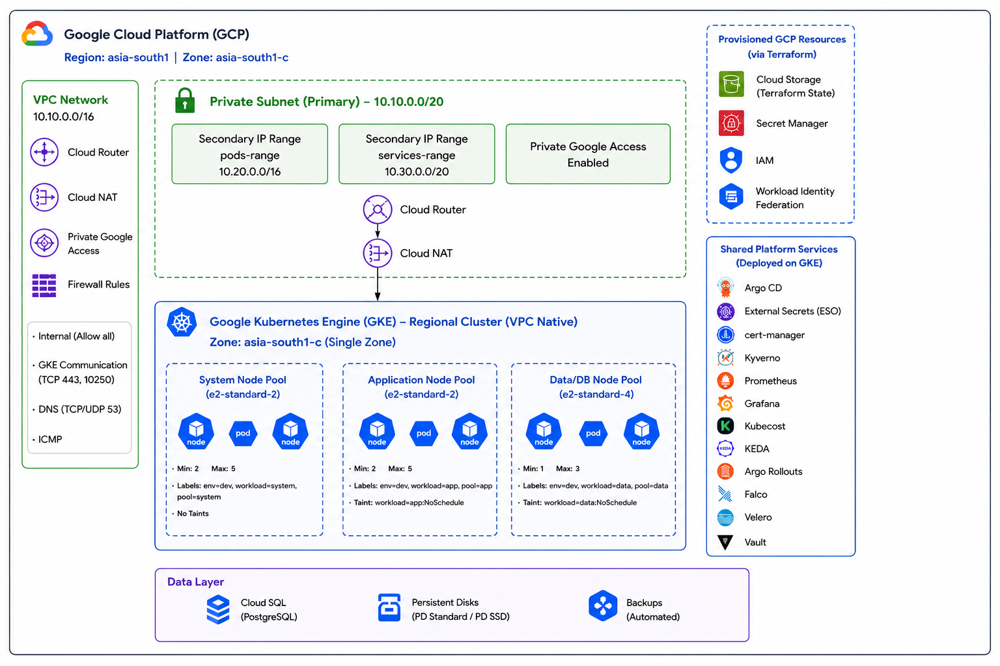
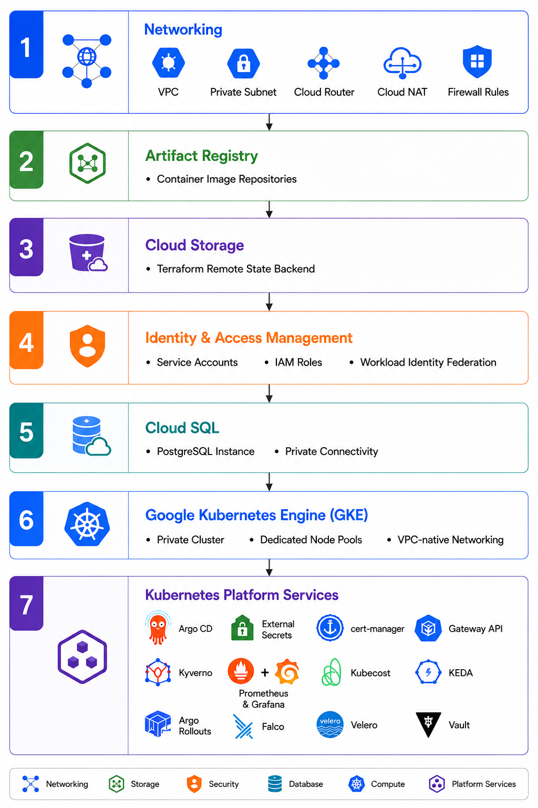
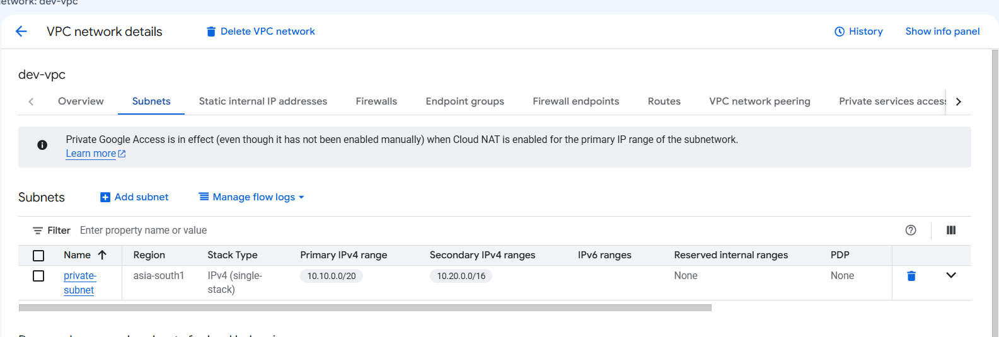
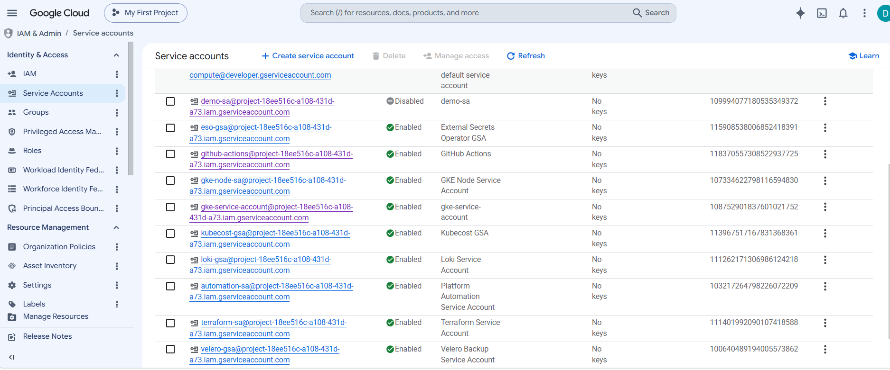
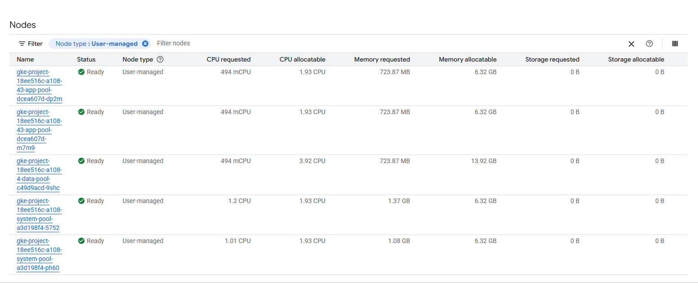
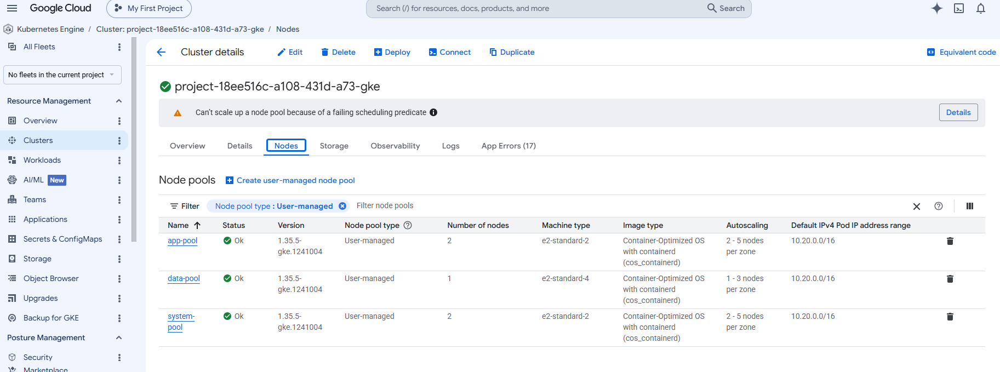
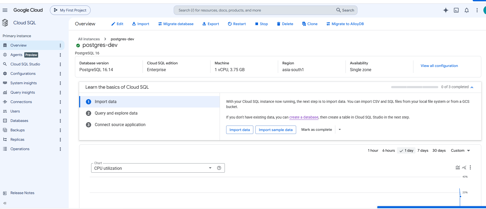
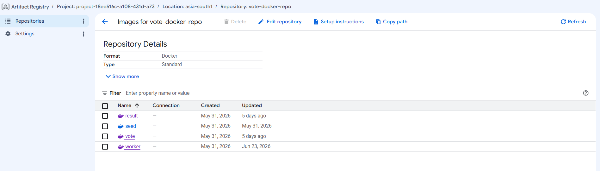
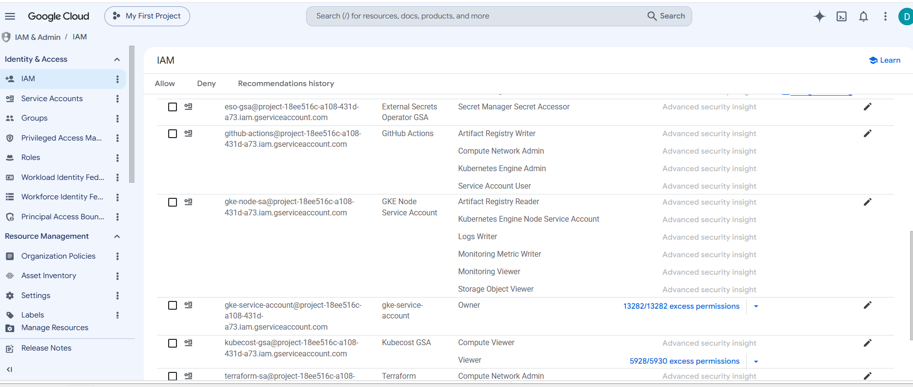

## GKE Infrastructure

**Terraform • Google Cloud Platform • Google Kubernetes Engine • Infrastructure as Code**

Terraform-based Infrastructure as Code (IaC) for provisioning a production-inspired cloud infrastructure on Google Cloud Platform (GCP), including networking, Google Kubernetes Engine (GKE), identity, storage, databases, and shared Kubernetes services.

This repository provisions the cloud infrastructure required to support a cloud-native Kubernetes environment. It includes networking, Google Kubernetes Engine (GKE), Identity and Access Management (IAM), Artifact Registry, Cloud Storage, Cloud SQL, and the foundational Kubernetes services needed to operate workloads securely and reliably. The infrastructure is implemented using modular, reusable Terraform modules to promote consistency, maintainability, and automation.

### Overview

This repository provisions and manages the foundational cloud infrastructure for a production-inspired cloud-native Kubernetes environment on Google Cloud Platform (GCP) using Terraform.

The infrastructure is organized as reusable Terraform modules that provision the core cloud resources required to operate Kubernetes workloads, including:

* Virtual Private Cloud (VPC) networking
* Google Kubernetes Engine (GKE)
* Identity and Access Management (IAM)
* Artifact Registry
* Cloud Storage
* Cloud SQL for PostgreSQL
* Shared Kubernetes services

In addition to cloud infrastructure, the repository automates the deployment of foundational Kubernetes services that support security, networking, observability, and cluster operations, providing a secure and scalable environment for cloud-native applications.

This repository is responsible exclusively for infrastructure provisioning and foundational Kubernetes services. Application source code, Kubernetes manifests, and deployment workflows are managed separately through GitHub Actions and a GitOps workflow with Argo CD, maintaining a clear separation between infrastructure management and application delivery.

### Objectives

* Provision cloud infrastructure using Terraform
* Build a private Google Kubernetes Engine (GKE) cluster
* Configure secure networking and Identity and Access Management (IAM)
* Deploy foundational Kubernetes services required for cluster operations
* Provide reusable Terraform modules for consistent infrastructure provisioning
* Establish the infrastructure required to support GitOps-based application deployments
* Promote repeatable, automated, and production-inspired infrastructure management

### Repository Scope

This repository includes:

* Google Cloud networking resources
* Google Kubernetes Engine (GKE) provisioning
* Identity and Access Management (IAM)
* Artifact Registry
* Cloud Storage
* Cloud SQL
* Foundational Kubernetes services
* Terraform modules and environment configurations

<div align="center">


This repository does **not** manage application deployments or business workloads. Those responsibilities are handled through dedicated application repositories and GitOps configuration repositories.

</div>

---
## Table of Contents

- [Overview](#overview)
- [Architecture](#architecture)
- [Infrastructure Capabilities](#infrastructure-capabilities)
- [Infrastructure Provisioning Flow](#infrastructure-provisioning-flow)
- [Repository Structure](#repository-structure)
- [Prerequisites](#prerequisites)
- [Getting Started](#getting-started)
- [Module Documentation](#module-documentation)
- [Screenshots](#screenshots)
- [Key Implementation Highlights](#key-implementation-highlights)
- [License](#license)

---
## Architecture

<p align="left">
  
</p>

---
## Infrastructure Capabilities

| Capability | Description |
|------------|-------------|
| **Infrastructure as Code** | Provisions cloud infrastructure using reusable and modular Terraform modules. |
| **Cloud Foundation** | Deploys foundational resources on Google Cloud Platform (GCP). |
| **Networking** | Configures a custom VPC, private subnet, Cloud Router, Cloud NAT, Private Google Access, and firewall rules. |
| **Kubernetes Platform** | Provisions a private, VPC-native Google Kubernetes Engine (GKE) cluster. |
| **Node Architecture** | Creates dedicated system, application, and data node pools with workload isolation using labels and taints. |
| **Identity & Access Management** | Implements IAM, service accounts, and Workload Identity Federation following least-privilege principles. |
| **Container Registry** | Provisions Artifact Registry repositories for container image storage. |
| **Terraform State** | Configures a Google Cloud Storage backend for remote Terraform state management. |
| **Database Services** | Provisions managed Cloud SQL for PostgreSQL with private connectivity. |
| **Secrets Management** | Integrates Google Secret Manager for centralized secret storage and access. |
| **GitOps Foundation** | Deploys Argo CD to enable GitOps-based platform and application delivery. |
| **Ingress & Traffic Management** | Deploys Gateway API and NGINX Gateway Fabric for Kubernetes traffic management. |
| **Certificate Management** | Automates TLS certificate lifecycle using cert-manager. |
| **External Secrets** | Synchronizes secrets from Google Secret Manager into Kubernetes using External Secrets Operator. |
| **Policy Enforcement** | Enforces Kubernetes security and governance policies with Kyverno. |
| **Observability** | Deploys Prometheus and Grafana for metrics collection, visualization, and monitoring. |
| **Event-Driven Autoscaling** | Enables workload autoscaling using Kubernetes Event-Driven Autoscaling (KEDA). |
| **Progressive Delivery** | Supports canary and blue-green deployments using Argo Rollouts. |
| **Cost Optimization** | Provides Kubernetes cost visibility and resource optimization through Kubecost. |
| **Runtime Security** | Implements runtime threat detection and behavioral monitoring with Falco. |
| **Backup & Disaster Recovery** | Enables backup, restore, and disaster recovery using Velero. |
| **Enterprise Secrets Platform** | Deploys HashiCorp Vault for advanced secrets management and secure workload authentication. |

---
## Infrastructure Provisioning Flow

Infrastructure is provisioned using a modular Terraform architecture, where each module is responsible for a specific layer of the platform. Resources are deployed in a defined sequence to satisfy dependencies, promote modularity, and ensure consistent, repeatable infrastructure provisioning across environments.

<p align="left">
  
</p>


The provisioning workflow establishes the complete cloud infrastructure and shared Kubernetes platform required to support application deployment. Once the infrastructure and platform services are operational, application workloads are deployed independently through a GitOps workflow, maintaining a clear separation between infrastructure lifecycle management and application delivery.

---
## Repository Structure

```
gke-infrastructure/
└── terraform/
    ├── environments                      
    |   |
    |   ├── dev    
    |   |    ├── networking/
    |   |    |      ├── .gitignore
    |   │    |      ├── main.tf
    |   |    |      ├── outputs.tf
    |   |    |      ├── provider.tf 
    |   |    |      ├── terraform.tfvars
    |   │    |      └── variables.tf
    |   │    |
    |   |    ├── cloud-sql/
    |   |    |      ├── .gitignore
    |   │    |      ├── main.tf
    |   |    |      ├── outputs.tf
    |   |    |      ├── provider.tf 
    |   |    |      ├── terraform.tfvars
    |   │    |      └── variables.tf
    |   │    |
    |   |    ├── gke/
    |   |    |      ├── .gitignore
    |   │    |      ├── main.tf
    |   |    |      ├── outputs.tf
    |   |    |      ├── provider.tf 
    |   |    |      ├── terraform.tfvars
    |   │    |      └── variables.tf
    |   │    |
    |   |    ├── iam/   
    |   |    |      ├── .gitignore
    |   │    |      ├── main.tf
    |   |    |      ├── outputs.tf
    |   |    |      ├── provider.tf 
    |   │    |      └── variables.tf
    |   │    |
    |   │    ├── platform/
    |   |    |        ├── argo-rollouts/ 
    |   |    |        |         ├── .gitignore
    |   │    |        |         ├── main.tf
    |   |    |        |         ├── outputs.tf
    |   |    |        |         ├── provider.tf
    |   |    |        |         ├── versions.tf 
    |   │    |        |         └── variables.tf
    |   |    |        ├── cert-manager/ 
    |   |    |        |         ├── .gitignore
    |   │    |        |         ├── main.tf
    |   |    |        |         ├── outputs.tf
    |   |    |        |         ├── provider.tf
    |   |    |        |         ├── versions.tf 
    |   │    |        |         └── variables.tf
    |   |    |        ├── argo-rollouts/ 
    |   |    |        |         ├── .gitignore
    |   │    |        |         ├── main.tf
    |   |    |        |         ├── outputs.tf
    |   |    |        |         ├── provider.tf
    |   |    |        |         ├── versions.tf 
    |   │    |        |         └── variables.tf
    |   |    |        ├── external-secrets/ 
    |   |    |        |         ├── .gitignore
    |   │    |        |         ├── main.tf
    |   |    |        |         ├── outputs.tf
    |   |    |        |         ├── provider.tf
    |   |    |        |         ├── versions.tf 
    |   │    |        |         └── variables.tf
    |   |    |        ├── falco/ 
    |   |    |        |         ├── .gitignore
    |   |    |        |         ├── backend.tf
    |   |    |        |         ├── data.tf  
    |   │    |        |         ├── main.tf
    |   |    |        |         ├── outputs.tf
    |   |    |        |         ├── provider.tf
    |   |    |        |         ├── versions.tf 
    |   │    |        |         └── variables.tf
    |   |    |        ├── keda/ 
    |   |    |        |         ├── .gitignore
    |   │    |        |         ├── main.tf
    |   |    |        |         ├── outputs.tf
    |   |    |        |         ├── provider.tf
    |   |    |        |         ├── versions.tf 
    |   │    |        |         └── variables.tf
    |   |    |        ├── kubecost/ 
    |   |    |        |         ├── .gitignore
    |   │    |        |         ├── main.tf
    |   |    |        |         ├── outputs.tf
    |   |    |        |         ├── provider.tf
    |   |    |        |         ├── versions.tf 
    |   │    |        |         └── variables.tf
    |   |    |        ├── kyverno/ 
    |   |    |        |         ├── .gitignore
    |   │    |        |         ├── main.tf
    |   |    |        |         ├── outputs.tf
    |   |    |        |         ├── provider.tf
    |   |    |        |         ├── versions.tf 
    |   │    |        |         └── variables.tf
    |   |    |        ├── monitoring/ 
    |   |    |        |         ├── .gitignore
    |   │    |        |         ├── main.tf
    |   |    |        |         ├── outputs.tf
    |   |    |        |         ├── provider.tf
    |   |    |        |         ├── versions.tf 
    |   │    |        |         └── variables.tf
    |   |    |        ├── nginx-gateway/ 
    |   |    |        |         ├── .gitignore
    |   │    |        |         ├── main.tf
    |   |    |        |         ├── outputs.tf
    |   |    |        |         ├── provider.tf
    |   |    |        |         ├── versions.tf 
    |   │    |        |         └── variables.tf
    |   |    |        ├── reloader/ 
    |   |    |        |         ├── .gitignore
    |   |    |        |         ├── backend.tf
    |   |    |        |         ├── data.tf  
    |   │    |        |         ├── main.tf
    |   |    |        |         ├── outputs.tf
    |   |    |        |         ├── provider.tf
    |   |    |        |         ├── versions.tf 
    |   │    |        |         └── variables.tf
    |   |    |        ├── storage-classes/ 
    |   |    |        |         ├── .gitignore
    |   │    |        |         ├── main.tf
    |   |    |        |         ├── outputs.tf
    |   |    |        |         ├── provider.tf
    |   |    |        |         ├── versions.tf 
    |   │    |        |         └── variables.tf
    |   |    |        ├── vault/ 
    |   |    |        |         ├── .gitignore
    |   |    |        |         ├── backend.tf
    |   |    |        |         ├── data.tf  
    |   │    |        |         ├── main.tf
    |   |    |        |         ├── outputs.tf
    |   |    |        |         ├── provider.tf
    |   |    |        |         ├── versions.tf 
    |   │    |        |         └── variables.tf
    |   |    |        └── velero/
    |   |    |                  ├── .gitignore
    |   |    |                  ├── backend.tf
    |   |    |                  ├── data.tf  
    |   │    |                  ├── main.tf
    |   |    |                  ├── outputs.tf
    |   |    |                  ├── provider.tf
    |   |    |                  ├── versions.tf 
    |   │    |                  └── variables.tf
    |   |    |        
    |   │    ├── storage/
    |   |    |        ├── artifact-registry/ 
    |   |    |        |         ├── .gitignore
    |   │    |        |         ├── main.tf
    |   |    |        |         ├── outputs.tf
    |   |    |        |         ├── provider.tf 
    |   │    |        |         └── variables.tf
    |   │    |        |
    |   |    |        └── cloud-storage/
    |   |    |                  ├── .gitignore
    |   │    |                  ├── main.tf
    |   |    |                  ├── outputs.tf
    |   |    |                  ├── provider.tf 
    |   │    |                  └── variables.tf
    |   |
    |   └── prod
    │
    └── modules/
        │
        ├── cloud-sql/              # Postgres SQL 
        │   ├── main.tf
        │   ├── variables.tf
        │   └── outputs.tf
        |
        ├── networking/              # VPC, subnets, firewall rules
        │   ├── main.tf
        │   ├── variables.tf
        │   └── outputs.tf
        │
        ├── gke/                     # GKE cluster, node pool, cluster autoscaler
        │   ├── main.tf
        │   ├── variables.tf
        │   └── outputs.tf
        │
        ├── iam/                     # Service accounts, IAM role bindings, Workload Identity
        │   ├── main.tf
        │   ├── variables.tf
        │   └── outputs.tf
        |
        ├── platform/
        |   ├── argo-rollouts/      
        │   │      ├── main.tf
        │   │      ├── variables.tf
        │   │      └── outputs.tf
        |   |
        |   ├── argocd/      
        │   │      ├── main.tf
        │   │      ├── variables.tf
        │   │      └── outputs.tf
        |   |
        |   ├── cert-manager/      
        │   │      ├── main.tf
        │   │      ├── variables.tf
        │   │      └── outputs.tf
        |   |
        |   ├── external-secrets/      
        │   │      ├── main.tf
        │   │      ├── variables.tf
        │   │      └── outputs.tf
        |   |
        |   ├── falco/      
        │   │      ├── main.tf
        │   │      ├── variables.tf
        │   │      └── outputs.tf
        |   |
        |   ├── keda/      
        │   │      ├── main.tf
        │   │      ├── variables.tf
        │   │      └── outputs.tf
        |   |
        |   ├── kubecost/      
        │   │      ├── main.tf
        │   │      ├── variables.tf
        │   │      └── outputs.tf
        |   |
        |   ├── kyverno/      
        │   │      ├── main.tf
        │   │      ├── variables.tf
        │   │      └── outputs.tf
        |   |
        |   ├── monitoring/      
        │   │      ├── main.tf
        │   │      ├── variables.tf
        │   │      └── outputs.tf
        |   |
        |   ├── nginx-gateway/      
        │   │      ├── main.tf
        │   │      ├── variables.tf
        │   │      └── outputs.tf
        |   |
        |   ├── reloader/      
        │   │      ├── main.tf
        │   │      ├── variables.tf
        │   │      └── outputs.tf
        |   |
        |   ├── storage-classes/      
        │   │      ├── main.tf
        │   │      ├── variables.tf
        │   │      └── outputs.tf
        |   |
        |   ├── vault/      
        │   │      ├── main.tf
        │   │      ├── variables.tf
        │   │      └── outputs.tf
        │   │
        |   └── velero/           
        |          ├── main.tf
        |          ├── variables.tf
        |          └── outputs.tf
        |
        ├── storage/
        |   └── artifact-registry/       # Artifact Registry Docker repository
        │   │      ├── main.tf
        │   │      ├── variables.tf
        │   │      └── outputs.tf
        │   │
            └── cloud-storage/           # GCS bucket for Terraform remote state & artefacts
                  ├── main.tf
                  ├── variables.tf
                  └── outputs.tf
```
---
## Prerequisites

Before deploying the infrastructure, ensure the following prerequisites are met.

### Google Cloud Platform

- Google Cloud project
- Billing account enabled
- Owner or Project Editor permissions
- Required Google Cloud APIs enabled:
  - Compute Engine API
  - Kubernetes Engine API
  - Artifact Registry API
  - Cloud Resource Manager API
  - Identity and Access Management (IAM) API
  - IAM Credentials API
  - Security Token Service (STS) API
  - Service Usage API
  - Secret Manager API
  - Cloud Storage API
  - SQL Admin API
  - Service Networking API

### Local Tools

| Tool | Version |
|------|---------|
| Terraform | >= 1.8 |
| Google Cloud CLI | Latest |
| kubectl | Compatible with the GKE cluster version |
| Git | Latest |

### Authentication

Authenticate with Google Cloud:

```bash
gcloud auth login

gcloud config set project <PROJECT_ID>

gcloud auth application-default login
```

### Terraform Backend

Before the initial deployment, create a Google Cloud Storage bucket to store the Terraform remote state.

Example:

```bash
gsutil mb -l asia-south1 gs://<terraform-state-bucket>
```

### Required Permissions

The authenticated identity should be able to create and manage:

- VPC Networks
- Subnets
- Firewall Rules
- Cloud Router
- Cloud NAT
- GKE Clusters and Node Pools
- Artifact Registry
- Cloud Storage Buckets
- Cloud SQL Instances
- IAM Roles and Service Accounts
- Workload Identity Federation
- Secret Manager resources

---
## Getting Started

This repository follows a modular Terraform architecture. Each directory under `terraform/environments/<environment>` represents an independent Terraform root module responsible for provisioning a specific layer of the infrastructure.

### Clone the Repository

```bash
git clone https://github.com/stackcouture/platform-infra.git
cd platform-infra
```

### Configure Google Cloud Authentication

```bash
gcloud auth login

gcloud config set project <PROJECT_ID>

gcloud auth application-default login
```

### Initialize Terraform

Navigate to the desired infrastructure module and initialize Terraform.

```bash
cd terraform/environments/dev/networking

terraform init
```

### Validate the Configuration

```bash
terraform validate
```

### Review the Execution Plan

```bash
terraform plan
```

### Apply the Configuration

```bash
terraform apply
```

Repeat the same workflow for each infrastructure module following the recommended deployment sequence.

---

### Deployment Order

| Order | Module | Purpose |
|------:|--------|---------|
| 1 | `networking` | VPC, Private Subnet, Cloud Router, Cloud NAT, Firewall Rules |
| 2 | `artifact-registry` | Artifact Registry repositories |
| 3 | `cloud-storage` | Terraform remote state backend |
| 4 | `iam` | IAM, Service Accounts, Workload Identity Federation |
| 5 | `cloud-sql` | Managed PostgreSQL |
| 6 | `gke` | Private GKE cluster and node pools |
| 7 | `platform/*` | Shared Kubernetes platform services |

### Verify the Deployment

Retrieve the Kubernetes cluster credentials.

```bash
gcloud container clusters get-credentials <CLUSTER_NAME> \
  --zone asia-south1-c
```

Verify that the cluster is operational.

```bash
kubectl get nodes
```

Verify the deployed node pools.

```bash
kubectl get nodes --show-labels
```

---
## Module Documentation

The infrastructure is organized into reusable Terraform modules, each responsible for provisioning a specific layer of the platform. This modular approach promotes separation of concerns, reusability, and simplified infrastructure lifecycle management.

| Module | Description | Primary Resources |
|---------|-------------|-------------------|
| **networking** | Provisions the networking foundation for the platform. | VPC, Private Subnet, Secondary IP Ranges, Cloud Router, Cloud NAT, Firewall Rules |
| **artifact-registry** | Creates private container image repositories. | Artifact Registry |
| **cloud-storage** | Configures remote Terraform state storage. | Google Cloud Storage Bucket |
| **iam** | Configures identity, authentication, and authorization. | IAM Roles, Service Accounts, Workload Identity Federation |
| **cloud-sql** | Deploys the managed PostgreSQL database. | Cloud SQL Instance, Database, Users, Private IP |
| **gke** | Creates the private Google Kubernetes Engine cluster and dedicated node pools. | GKE Cluster, System/App/Data Node Pools |
| **platform/argocd** | Deploys Argo CD for GitOps-based continuous delivery. | Argo CD |
| **platform/external-secrets** | Synchronizes secrets from Google Secret Manager into Kubernetes. | External Secrets Operator, ClusterSecretStore |
| **platform/cert-manager** | Automates TLS certificate management. | cert-manager, ClusterIssuer, Certificate |
| **platform/nginx-gateway** | Deploys the Kubernetes Gateway API implementation. | Gateway API, NGINX Gateway Fabric |
| **platform/kyverno** | Enforces Kubernetes security and governance policies. | Kyverno, ClusterPolicies |
| **platform/monitoring** | Deploys the monitoring stack. | Prometheus, Grafana, Alertmanager |
| **platform/kubecost** | Provides Kubernetes cost visibility. | Kubecost |
| **platform/keda** | Enables event-driven autoscaling. | KEDA Operator, ScaledObjects |
| **platform/argo-rollouts** | Enables progressive delivery strategies. | Argo Rollouts, AnalysisTemplates |
| **platform/falco** | Provides runtime threat detection. | Falco |
| **platform/velero** | Enables backup and disaster recovery. | Velero |
| **platform/vault** | Deploys centralized secrets management. | HashiCorp Vault |
| **platform/reloader** | Automatically restarts workloads when ConfigMaps or Secrets change. | Stakater Reloader |
| **platform/storage-classes** | Creates Kubernetes StorageClasses. | StorageClasses |

---
## Screenshots 

<h5>VPC</h5> 
<p align="left">
  
</p>

<h5>Service Accounts</h5> 
<p align="left">
  
</p>

<h5>Nodes</h5> 
<p align="left">
  
</p>

<h5>Node Pools</h5> 
<p align="left">
  
</p>

<h5>Cloud SQL</h5> 
<p align="left">
  
</p>

<h5>Artifact Repository</h5> 
<p align="left">
  
</p>

<h5>IAM Accounts</h5> 
<p align="left">
  
</p>

---
## Key Implementation Highlights

Building this infrastructure provided hands-on experience in designing, provisioning, and managing production-inspired cloud infrastructure on Google Cloud Platform using Infrastructure as Code (IaC).

### Infrastructure as Code

- Designed reusable and modular Terraform modules
- Managed infrastructure using independent Terraform root modules
- Implemented remote state management with Google Cloud Storage
- Consumed remote state outputs across infrastructure modules
- Applied infrastructure lifecycle management using Terraform

### Google Cloud Platform

- Designed secure VPC networking with private subnets
- Configured Cloud Router, Cloud NAT, and Private Google Access
- Provisioned a private Google Kubernetes Engine (GKE) cluster
- Implemented dedicated node pools with workload isolation
- Provisioned Cloud SQL, Artifact Registry, and Cloud Storage resources

### Identity & Security

- Implemented least-privilege IAM policies
- Configured Workload Identity Federation for secure workload authentication
- Managed secrets using Google Secret Manager and External Secrets
- Applied Kubernetes security policies using Kyverno

### Kubernetes Platform Engineering

- Provisioned shared Kubernetes platform services using Terraform
- Configured Gateway API for ingress and traffic management
- Implemented automated TLS certificate management with cert-manager
- Enabled monitoring, autoscaling, and progressive delivery capabilities

### Infrastructure Design

- Built a modular and scalable infrastructure architecture
- Established clear separation between infrastructure provisioning and application deployment
- Followed Infrastructure as Code best practices for maintainability and reusability
- Documented infrastructure using production-style repository standards

---
## License

This project is licensed under the **MIT License**. See the [LICENSE](LICENSE) file for details.

---